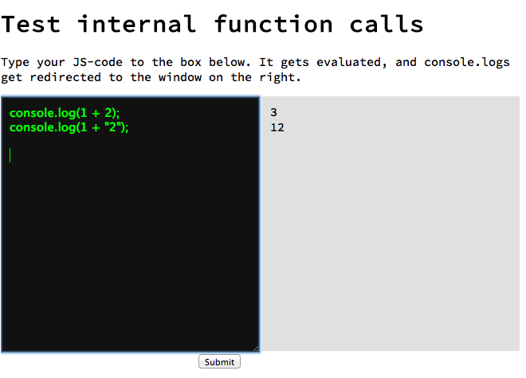

js-transparency-repl
====================

A JS repl, that exposes internal functioning (from V8) of basic operators.

Type coercion in JS is something many people struggle to understand correctly. It would be great to have tools that makes understanding internal workings of JS engines easier - this is an attempt to make such a tool.

The code for the operators is copied from V8, with minor modifications to break larger dependencies to V8 codebase and to make it work in the browser.

Currently overriden in REPL:
+
(under construction) == 

Implementation: 
"Submit" triggers generation of an AST (abstract syntax tree) using Esprima. Uses of '+' operator are replaced by function calls to the ADD-function, and code is re-generated (using escodegen) and evaluated (using plain old eval).

TODO: 
  - Support == operator replacement
  - Move logging from internal functions to the transparency-repl screen instead of console
  - Improve UI
  - Support more operators
  
